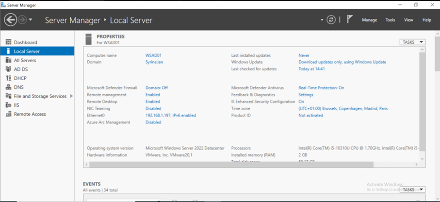
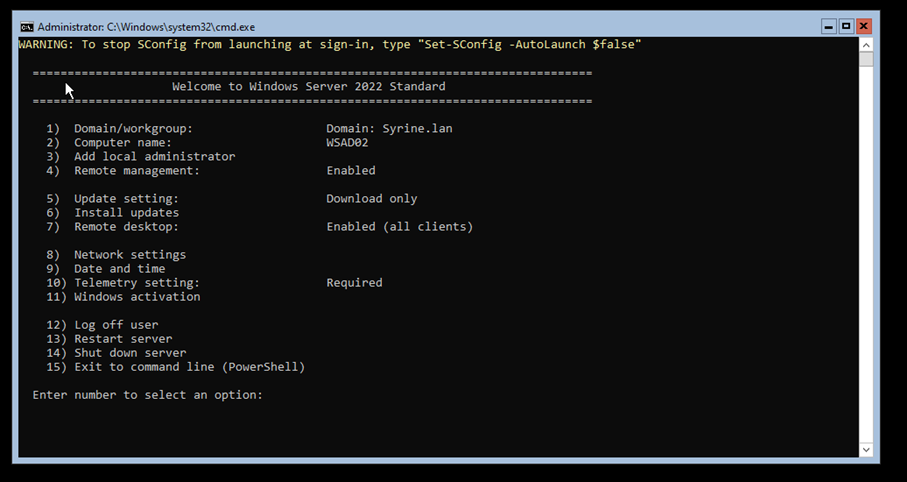
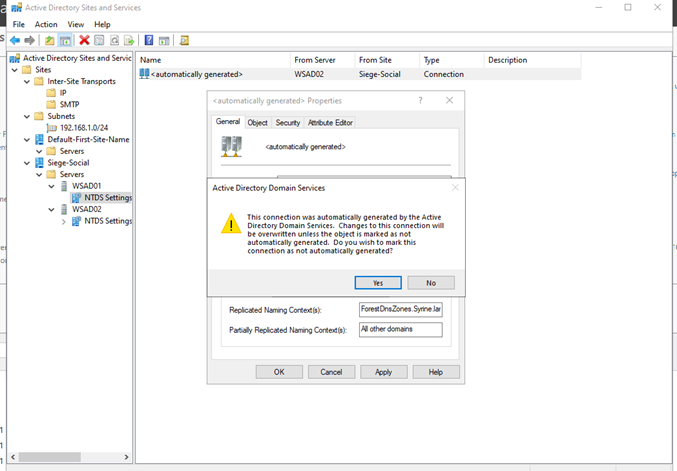
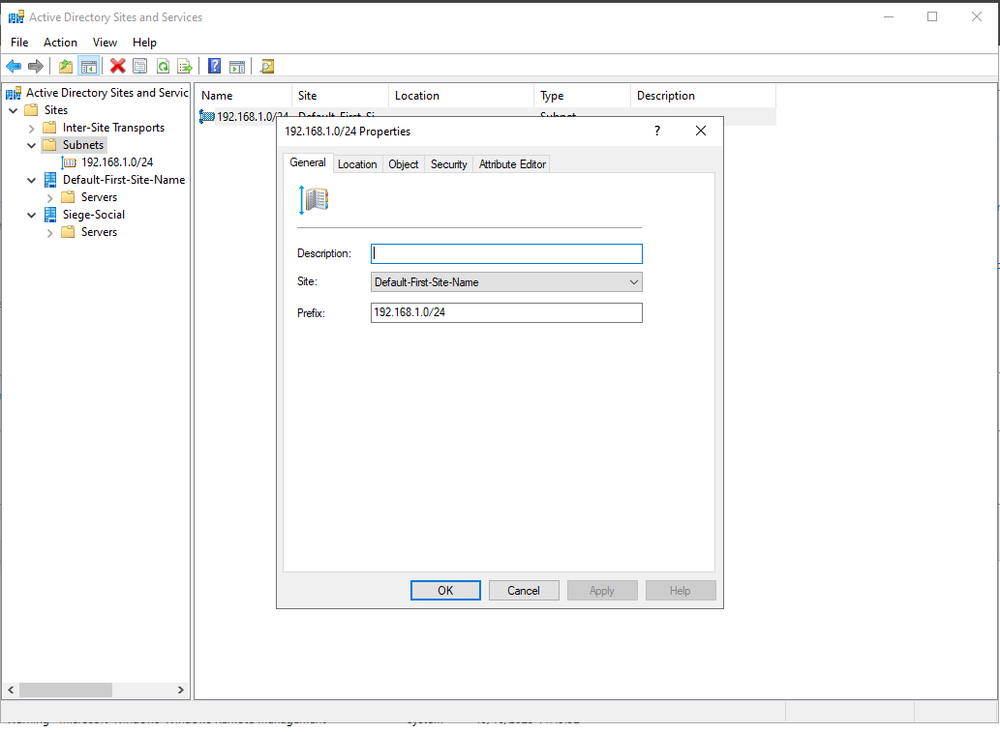
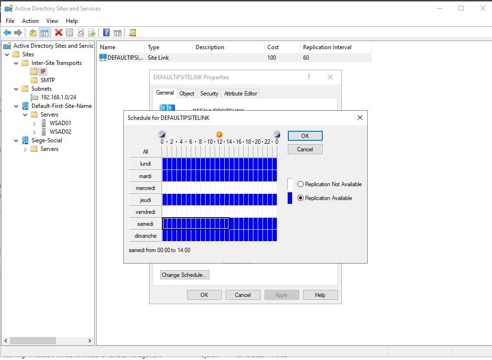
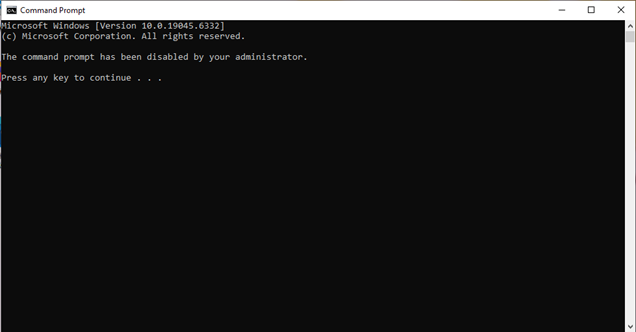
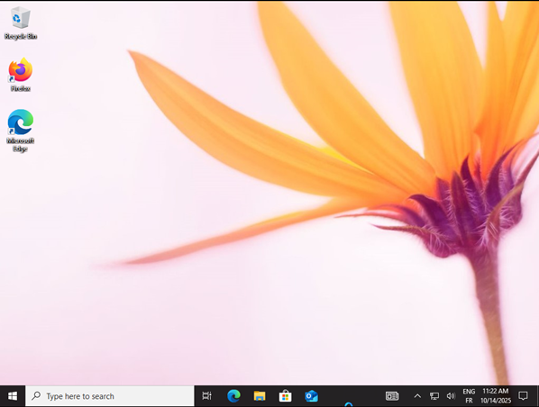
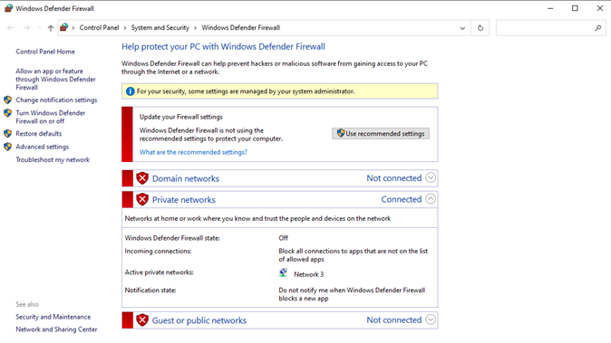
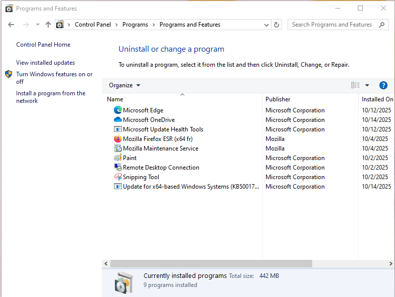

# Infrastructure Windows Entreprise – AD DS, DNS, DFS, GPO, WDS, MDT

[](https://www.microsoft.com/windows-server)
[](https://docs.microsoft.com/en-us/windows-server/identity/ad-ds/ad-ds-getting-started)
[](https://docs.microsoft.com/en-us/windows-server/storage/dfs-replication/dfsr-overview)
[](https://docs.microsoft.com/en-us/windows/security/threat-protection/windows-security-baselines)
[](https://docs.microsoft.com/en-us/windows-server/administration/windows-deployment-services/windows-deployment-services-overview)
[](https://docs.microsoft.com/en-us/windows/deployment/deploy-windows-mdt/get-started-with-the-microsoft-deployment-toolkit)

> Projet d'infrastructure Windows complète : Active Directory, DNS, DFS, GPO, WDS et MDT.  
> Mise en place d'une architecture d'entreprise avec déploiement automatisé et sécurisé.

---

## Table des matières

- [Architecture globale](#-architecture-globale)
- [Active Directory & DNS](#-active-directory--dns)
- [DFS - Distributed File System](#-dfs---distributed-file-system)
- [GPO - Group Policy Objects](#-gpo---group-policy-objects)
  - [Liste des GPO déployées](#liste-des-gpo-déployées)
  - [Vérification des GPO](#vérification-des-gpo)
- [WDS - Windows Deployment Services](#-wds---windows-deployment-services)
- [MDT - Microsoft Deployment Toolkit](#-mdt---microsoft-deployment-toolkit)
- [Problèmes rencontrés](#-problèmes-rencontrés)
- [Structure du dépôt](#-structure-du-dépôt)
- [Ressources](#-ressources)

---

## Architecture globale

| Rôle | Serveur | IP | Description |
|------|---------|-----|-------------|
| Contrôleur de domaine 1 | DC1 (GUI) | 192.168.1.101 | AD DS, DNS, DFS, GPO |
| Contrôleur de domaine 2 | DC2 (Core) | 192.168.1.102 | Réplication AD, redondance |
| WDS + MDT | SRV-DEPLOY | 192.168.1.103 | Déploiement réseau et PXE |

---

## Active Directory & DNS

### Installation du premier contrôleur de domaine (DC1)



### Installation du deuxième contrôleur (DC2 - Mode Core)



### Configuration DNS



**Configuration :**

| Élément | Détail |
|---------|--------|
| Nom du domaine | `holding.local` |
| DC1 | Interface graphique (GUI) |
| DC2 | Mode Core (sans interface) |
| DNS | Intégré à l'Active Directory |
| Réplication | DC1 → DC2 automatique |

---

## DFS - Distributed File System

### Installation de DFS



### Configuration des partages



### Réplication DFS


**Configuration :**

| Élément | Détail |
|---------|--------|
| Namespace | `\\holding.local\DFS` |
| Dossiers répliqués | Documents, Applications, Données |
| Topologie | Hub and spoke |
| Planification | Réplication continue |

---

## GPO - Group Policy Objects

### Liste des GPO déployées

| # | GPO | Effet | Statut |
|---|-----|-------|--------|
| 1 | **Désactivation CMD** | Bloque l'invite de commande | ✅ |
| 2 | **Désactivation Registre** | Bloque l'accès à regedit | ✅ |
| 3 | **Désactivation Windows Update** | Désactive les mises à jour auto | ✅ |
| 4 | **Fond d'écran personnalisé** | Applique un wallpaper corporate | ✅ |
| 5 | **Désactivation Pare-feu** | Désactive Windows Firewall | ✅ |
| 6 | **Installation logiciels** | Déploiement 7-Zip + Firefox | ✅ |

### Captures des GPO

| GPO | Capture |
|-----|---------|
| Désactivation CMD |  |
| Désactivation Registre |  |
| Désactivation Windows Update |  |
| Fond d'écran |  |
| Désactivation Pare-feu |  |
| Déploiement 7-Zip + Firefox |  |

### Vérification des GPO

#### Résultat de `gpresult /h`


#### Détails des GPO appliquées


**Commandes utiles :**


# Forcer la mise à jour des GPO
```powershell
gpupdate /force
```

# Générer un rapport HTML des GPO appliquées
```powershell
gpresult /h C:\rapport-gpo.html
```
WDS - Windows Deployment Services


Configuration WDS :

Élément	Détail
Images boot	boot.wim (Windows PE)
Images install	install.wim (Windows 10/11)
Réponse PXE	Tous les clients
Capture	Image sysprepée
MDT - Microsoft Deployment Toolkit


# Problèmes rencontrés
Erreur BCDBoot
Lors du déploiement final via MDT, une erreur est survenue :

text
Échec de BCDBoot
Source inconnue
Cause : Généralement liée aux partitions/disque
Fichier introuvable
https://screenshots/05-MDT/28-mdt-error-bcdboot.png

# Hypothèses :

- Problème de partitionnement du disque cible (MBR vs GPT)

- Fichiers de boot manquants dans l'image

- Incompatibilité de format de disque

- Tentatives de résolution :

- Vérification des partitions

- Modification du format de disque

- Reconstruction manuelle du BCD

- Le problème n'a pas pu être résolu dans le temps imparti, mais l'infrastructure (AD, DNS, DFS, GPO, WDS, MDT) reste fonctionnelle.


# Ressources
Documentation Active Directory

DFS Replication

Group Policy

Windows Deployment Services

Microsoft Deployment Toolkit

Aides utilisées pour les GPO :

Désactivation firewall : sys-advisor.com

Configuration fond d'écran : techexpert.tips

Désactivation mises à jour : techexpert.tips

# Auteur
Projet réalisé par Syrine dans le cadre du TP Final Architecture Windows.

# Conclusion
Ce projet démontre une maîtrise avancée de l'infrastructure Windows :
Mise en place d'un domaine Active Directory redondé
Configuration DNS intégrée
Déploiement DFS avec réplication
Création et application de 6 GPO
Configuration WDS pour déploiement réseau (PXE)
Installation et configuration MDT
Déploiement final bloqué par erreur BCDBoot
